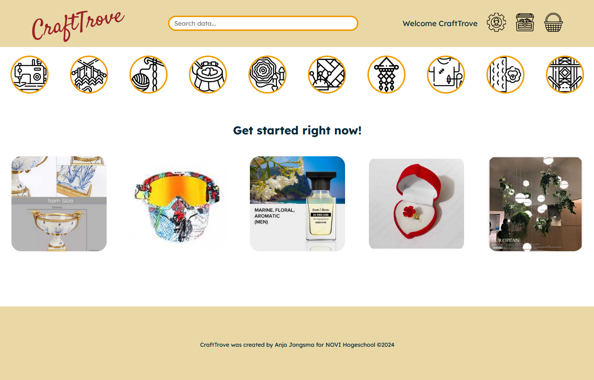

# Eindopdracht Frontend: CraftTrove - webshop

## Inleiding
Welkom op CraftTrove, een schatkist vol inspiratie. Laat je inspireren door designers binnen de textiele ambachten en ga zelf aan de slag met hun ontwerpen.
De applicatie bevat een zoekbalk, om producten individueel te kunnen bezoeken. Via de navigatie bar (op enkele pagina's onder de header) is het mogelijk een overzicht te krijgen per categorie. Er kan een winkelmandje gevuld worden en het is mogelijk een eigen account aan te maken.

Op dit moment wordt CraftTrove gevuld door de data van de DummyJSON-API, een API met test-data voor webshops. Helaas biedt deze API weinig handwerk en al helemaal geen patronen. We hopen dat je hier doorheen kunt kijken tot een beter API zich aandient.

De Github repository vind je hier: https://github.com/AnjaMJM/Eindopdracht-FE-CraftTrove



## Applicatie starten

Het project is opgezet met Vite. Na het openen van het project, installeer je eerst de `node_modules` door het volgende
commando in de terminal te runnen:

```
npm install
```

Wanneer dit klaar is, kun je de applicatie starten met behulp van:

```
npm run dev
```

Open de localhost (meestal [http://localhost:5173](http://localhost:5173/), maar een ander nummer kan ook, als 5173 op dat moment al in gebruik is) om de pagina in de browser te bekijken. 

## Libraries
De applicatie maakt gebruik van de volgende libraries:

`axios` , `react-router-dom` en `jwt-decode`

Deze zouden gelijk met het uitvoeren van de npm install geïnstalleerd moeten worden.
Dit kun je controleren in de package.json onder 'dependencies'. Dit zou er als volgt uit moeten zien:

```
"dependencies": {
    "axios": "^1.6.8",
    "jwt-decode": "^4.0.0",
    "react": "^18.2.0",
    "react-dom": "^18.2.0",
    "react-router-dom": "^6.22.3"
```
Of een recentere versie

## API's: 

Voor deze webshop worden twee API's gebruikt, te weten:

Fake store API, voor de winkeldata: https://dummyjson.com/ (geen API-key nodig)
NOVI Educational Backend, voor de registratie en login: https://novi.datavortex.nl (API-key;  crafttrove:A9GPZ9fuTVS4x1u6oimE)

Om met een bestaand account in te loggen:

 username: CraftTrove 

 password: wachtwoord

### credits
icons via flaticon.com, attributed to:
   - Smashicons
   - Freepik
   - Gravisio
   - Becris
   - Eucalyp
   - Darius Dan
   - HideMaru
